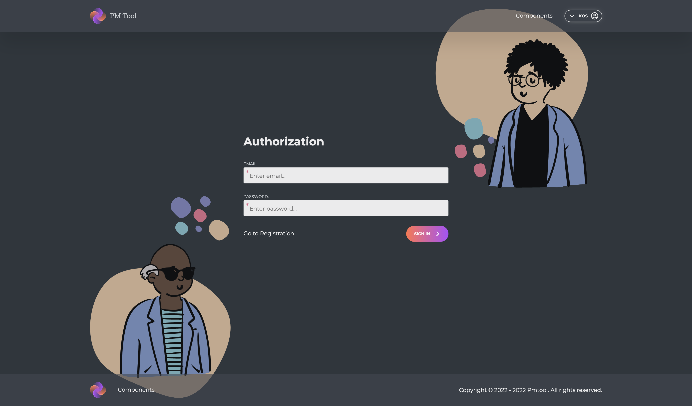
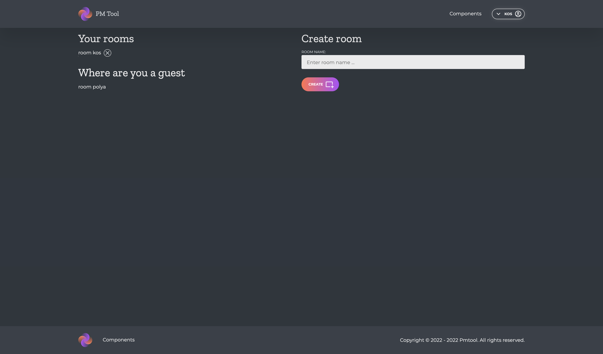
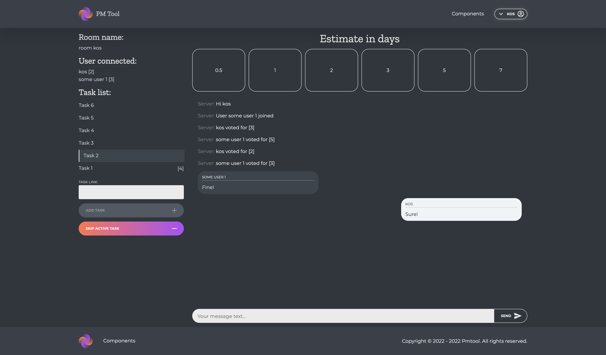
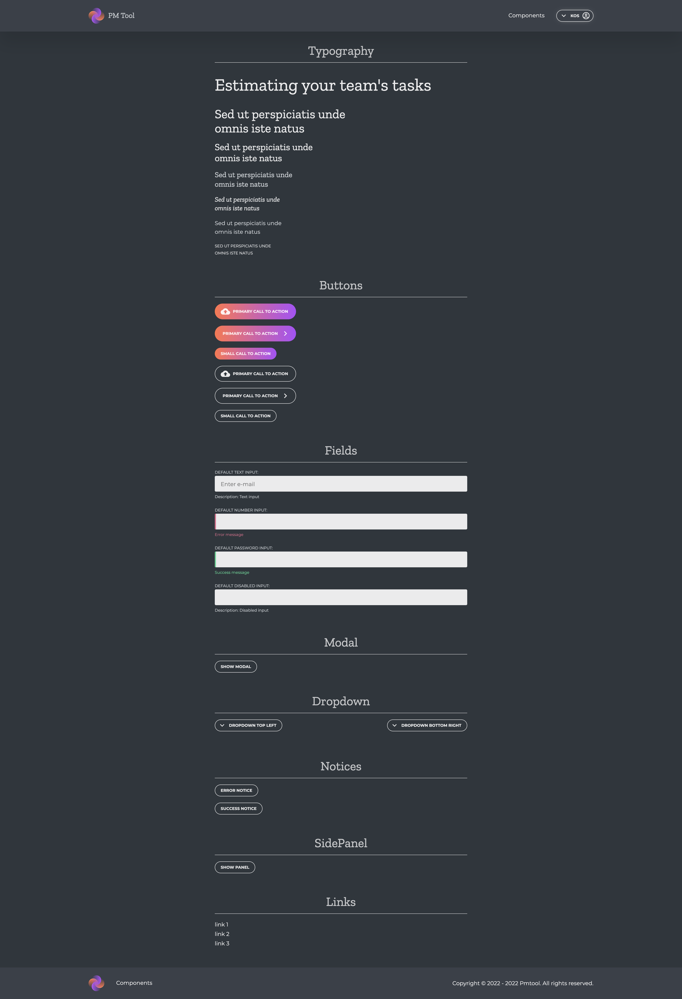

# PM Tool ⚙️

- [Frontend app](https://github.com/kostyamm/pm-tool/tree/main/client) Vue 3 / Vite / Element Plus UI / Socket.io (client)
- [Backend app](https://github.com/kostyamm/pm-tool/tree/main/server) Express / MongoDB (mongoose) / Socket.io (server)

## About 📝
This is a demo project for estimating tasks.

Yes, of course, business logic needs to be improved here, but the foundation is already ready.

## Launch developer mode 🏗
#### For server and client directory

- ``npm ci && npm run dev``

## Screenshots 🤳
### Login

### User rooms

### Room for estimating

### Components

